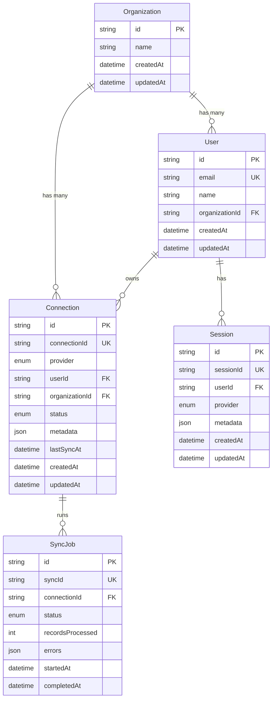

# Database Schema Reference - Atlas Integration Platform

**Last Updated**: August 6, 2025  
**Purpose**: Complete database schema documentation and relationships

---

## Overview

Atlas uses PostgreSQL as its primary database with Prisma ORM for schema management and query building. The database stores user authentication, OAuth connections, sync job tracking, and session management data. The actual integration data is stored in Zep Cloud's knowledge graph.

### Database Configuration
- **Database**: PostgreSQL (any modern version)
- **ORM**: Prisma 5.22.0
- **Connection**: Environment variable `DATABASE_URL`
- **Migrations**: Managed via `prisma migrate`

---

## Schema Overview

The database consists of 5 main models organized around multi-tenant user and organization management:



---

## Model Details

### User Model

Represents individual users within organizations who can create OAuth connections.

```prisma
model User {
  id              String       @id @default(cuid())
  email           String       @unique
  name            String?
  organizationId  String
  organization    Organization @relation(fields: [organizationId], references: [id])
  connections     Connection[]
  sessions        Session[]
  createdAt       DateTime     @default(now())
  updatedAt       DateTime     @updatedAt
  
  @@index([organizationId])
}
```

**Fields**:
- `id`: Unique identifier (CUID format: `clxxxxxxxxxx`)
- `email`: User's email address (unique constraint)
- `name`: Optional display name
- `organizationId`: Foreign key to Organization
- `createdAt/updatedAt`: Automatic timestamps

**Relationships**:
- Belongs to one Organization
- Has many Connections (OAuth integrations)
- Has many Sessions (authentication sessions)

**Indexes**:
- Primary key on `id`
- Unique index on `email`
- Performance index on `organizationId`

### Organization Model

Represents organizations that contain users and their connections. Provides multi-tenant isolation.

```prisma
model Organization {
  id          String       @id @default(cuid())
  name        String
  users       User[]
  connections Connection[]
  createdAt   DateTime     @default(now())
  updatedAt   DateTime     @updatedAt
}
```

**Fields**:
- `id`: Unique identifier (CUID format)
- `name`: Organization display name
- `createdAt/updatedAt`: Automatic timestamps

**Relationships**:
- Has many Users
- Has many Connections (through users)

**Business Logic**:
- Organizations provide data isolation boundaries
- All connections are scoped to an organization
- Knowledge graphs use organization + project ID for namespacing

### Connection Model

Stores OAuth connection information for external integrations (GitHub, Notion, Jira, Slack).

```prisma
model Connection {
  id             String       @id @default(cuid())
  provider       Provider
  connectionId   String       @unique
  userId         String
  user           User         @relation(fields: [userId], references: [id], onDelete: Cascade)
  organizationId String
  organization   Organization @relation(fields: [organizationId], references: [id], onDelete: Cascade)
  status         ConnectionStatus @default(ACTIVE)
  metadata       Json?
  lastSyncAt     DateTime?
  syncJobs       SyncJob[]
  createdAt      DateTime     @default(now())
  updatedAt      DateTime     @updatedAt
  
  @@index([userId])
  @@index([organizationId])
  @@index([provider, status])
}
```

**Fields**:
- `id`: Unique identifier
- `provider`: Integration provider (enum)
- `connectionId`: Unique connection ID from Nango (format: `{orgId}_{projectId}`)
- `userId`: Foreign key to User who owns the connection
- `organizationId`: Foreign key to Organization for multi-tenancy
- `status`: Connection state (enum)
- `metadata`: JSON field for provider-specific data
- `lastSyncAt`: Timestamp of last successful sync

**Enums**:
```prisma
enum Provider {
  GITHUB
  NOTION
  JIRA
  SLACK
}

enum ConnectionStatus {
  ACTIVE      // Connection working normally
  INACTIVE    // Connection disabled/disconnected
  ERROR       // Connection has errors (auth, sync, etc.)
  EXPIRED     // OAuth token expired, needs refresh
}
```

**Relationships**:
- Belongs to one User (cascade delete)
- Belongs to one Organization (cascade delete)  
- Has many SyncJobs

**Indexes**:
- Primary key on `id`
- Unique index on `connectionId`
- Performance indexes on `userId`, `organizationId`, and `provider + status`

**Metadata Examples**:
```json
// GitHub connection metadata
{
  "accountName": "username",
  "repositories": ["atlas", "docs"],
  "permissions": ["read:user", "read:repo"],
  "installationId": "12345"
}

// Error state metadata
{
  "lastError": {
    "message": "OAuth token expired",
    "code": "TOKEN_EXPIRED",
    "timestamp": "2025-08-06T10:00:00.000Z"
  }
}
```

### SyncJob Model

Tracks data synchronization jobs for monitoring and debugging purposes.

```prisma
model SyncJob {
  id           String       @id @default(cuid())
  syncId       String       @unique
  connectionId String
  connection   Connection   @relation(fields: [connectionId], references: [id], onDelete: Cascade)
  status       SyncStatus
  recordsProcessed Int     @default(0)
  errors       Json?
  startedAt    DateTime     @default(now())
  completedAt  DateTime?
  
  @@index([connectionId])
  @@index([status])
}
```

**Fields**:
- `id`: Unique identifier
- `syncId`: Unique sync identifier (format: `sync_{timestamp}`)
- `connectionId`: Foreign key to Connection
- `status`: Current sync status (enum)
- `recordsProcessed`: Count of successfully processed records
- `errors`: JSON array of error details
- `startedAt`: Sync start time
- `completedAt`: Sync completion time (null if still running)

**Enums**:
```prisma
enum SyncStatus {
  PENDING      // Sync queued but not started
  IN_PROGRESS  // Currently syncing
  COMPLETED    // Sync finished successfully  
  FAILED       // Sync encountered errors
}
```

**Relationships**:
- Belongs to one Connection (cascade delete)

**Indexes**:
- Primary key on `id`
- Unique index on `syncId`
- Performance indexes on `connectionId` and `status`

**Error Examples**:
```json
{
  "errors": [
    {
      "message": "Rate limit exceeded",
      "code": "RATE_LIMIT",
      "timestamp": "2025-08-06T10:15:00.000Z",
      "retryAfter": 300
    },
    {
      "message": "Invalid repository access",
      "code": "ACCESS_DENIED", 
      "repository": "private-repo",
      "timestamp": "2025-08-06T10:16:00.000Z"
    }
  ]
}
```

### Session Model

Manages authentication sessions for Nango OAuth flows and API access.

```prisma
model Session {
  id        String   @id @default(cuid())
  sessionId String   @unique
  userId    String
  user      User     @relation(fields: [userId], references: [id], onDelete: Cascade)
  provider  Provider
  metadata  Json?
  createdAt DateTime @default(now())
  updatedAt DateTime @updatedAt
  
  @@index([userId])
}
```

**Fields**:
- `id`: Unique identifier
- `sessionId`: Unique session token
- `userId`: Foreign key to User
- `provider`: Provider for this auth session
- `metadata`: Session-specific data (JWT claims, expiry, etc.)
- `createdAt/updatedAt`: Automatic timestamps

**Relationships**:
- Belongs to one User (cascade delete)

**Indexes**:
- Primary key on `id`
- Unique index on `sessionId`
- Performance index on `userId`

**Metadata Example**:
```json
{
  "tokenExpiry": "2025-08-06T12:00:00.000Z",
  "scope": ["read:user", "read:repo"],
  "integrationId": "github",
  "nonce": "abc123def456"
}
```

---

## Database Operations

### Common Queries

#### Get User with Connections
```typescript
const user = await prisma.user.findUnique({
  where: { email: 'user@example.com' },
  include: {
    organization: true,
    connections: {
      include: {
        syncJobs: {
          orderBy: { startedAt: 'desc' },
          take: 5
        }
      }
    }
  }
});
```

#### Find Active Connections by Provider
```typescript
const githubConnections = await prisma.connection.findMany({
  where: {
    provider: 'GITHUB',
    status: 'ACTIVE',
    organizationId: orgId
  },
  include: {
    user: { select: { name: true, email: true } }
  }
});
```

#### Track Sync Job Progress
```typescript
const syncJob = await prisma.syncJob.upsert({
  where: { syncId: 'sync_1725627600000' },
  update: {
    status: 'COMPLETED',
    recordsProcessed: 150,
    completedAt: new Date()
  },
  create: {
    syncId: 'sync_1725627600000',
    connectionId: 'conn_123',
    status: 'IN_PROGRESS',
    recordsProcessed: 0
  }
});
```

#### Connection Status Statistics
```typescript
const stats = await prisma.connection.groupBy({
  by: ['provider', 'status'],
  where: { organizationId: orgId },
  _count: { id: true }
});
```

### Performance Optimizations

#### Connection Indexes
```sql
-- Optimize connection lookups by provider and status
CREATE INDEX CONCURRENTLY idx_connection_provider_status 
ON "Connection" (provider, status);

-- Optimize organization-scoped queries
CREATE INDEX CONCURRENTLY idx_connection_org_provider 
ON "Connection" (organizationId, provider);
```

#### Query Optimization Tips
- Always include `organizationId` in multi-tenant queries
- Use `select` to limit returned fields for large datasets
- Consider pagination for connection and sync job lists
- Use `include` judiciously to avoid N+1 query problems

---

## Migration Management

### Prisma Migrations

The schema is managed through Prisma migrations in the `prisma/migrations/` directory.

#### Development Workflow
```bash
# Create new migration after schema changes
npx prisma migrate dev --name add_new_field

# Reset database in development (destructive)
npx prisma migrate reset

# Generate Prisma client after schema changes
npx prisma generate
```

#### Production Deployment
```bash
# Apply migrations to production database
npx prisma migrate deploy

# Verify schema state
npx prisma migrate status
```

### Schema Evolution Examples

#### Adding New Provider
```prisma
// 1. Update enum
enum Provider {
  GITHUB
  NOTION
  JIRA
  SLACK
  LINEAR  // New provider
}

// 2. Generate migration
// npx prisma migrate dev --name add_linear_provider

// 3. Update application code to handle LINEAR provider
```

#### Adding Connection Metadata Field
```prisma
model Connection {
  // ... existing fields
  lastErrorAt DateTime? // New field
  // ... rest of model
}
```

---

## Data Relationships and Constraints

### Cascade Behaviors

**User Deletion**: When a user is deleted:
- All connections are deleted (CASCADE)
- All sessions are deleted (CASCADE)
- Related sync jobs are deleted (through connection CASCADE)

**Organization Deletion**: When an organization is deleted:
- All users are deleted (CASCADE)  
- All connections are deleted (CASCADE)
- All related sessions and sync jobs are deleted (through CASCADE chain)

**Connection Deletion**: When a connection is deleted:
- All sync jobs are deleted (CASCADE)
- Sessions remain (no direct relationship)

### Referential Integrity

All foreign key relationships are enforced at the database level:
- `User.organizationId` ’ `Organization.id`
- `Connection.userId` ’ `User.id`
- `Connection.organizationId` ’ `Organization.id`
- `SyncJob.connectionId` ’ `Connection.id`
- `Session.userId` ’ `User.id`

### Unique Constraints

- `User.email`: Global unique constraint
- `Connection.connectionId`: Global unique constraint (Nango connection ID)
- `SyncJob.syncId`: Global unique constraint
- `Session.sessionId`: Global unique constraint

---

## Backup and Recovery

### Backup Strategy
```bash
# Full database backup
pg_dump $DATABASE_URL > atlas_backup_$(date +%Y%m%d_%H%M%S).sql

# Schema-only backup
pg_dump --schema-only $DATABASE_URL > atlas_schema_backup.sql

# Data-only backup  
pg_dump --data-only $DATABASE_URL > atlas_data_backup.sql
```

### Recovery Process
```bash
# Restore full backup
psql $DATABASE_URL < atlas_backup_20250806_120000.sql

# Restore with Prisma migration verification
npx prisma migrate deploy
npx prisma generate
```

### Data Retention

**Connection Data**: Retained indefinitely while connection is active
**Sync Jobs**: Recommend retention of 90 days for debugging
**Sessions**: Automatically expire, cleanup via cron job
**User/Organization**: Retained until explicitly deleted

---

## Security Considerations

### Data Protection
- Sensitive OAuth tokens stored in Nango, not in Atlas database
- Connection metadata may contain sensitive information (encrypt at rest)
- Session tokens should be treated as sensitive credentials

### Access Patterns
- All queries should be scoped by `organizationId` for multi-tenancy
- User access should be validated before database operations
- Connection modifications should verify user ownership

### Audit Logging
Consider adding audit trail fields:
```prisma
// Example audit fields (not currently implemented)
model Connection {
  // ... existing fields
  createdBy   String?   // User who created connection
  modifiedBy  String?   // User who last modified
  deletedAt   DateTime? // Soft delete timestamp
  deletedBy   String?   // User who deleted
}
```

---

This database reference provides comprehensive documentation of Atlas's PostgreSQL schema. For API integration patterns and query examples, refer to the API reference documentation.